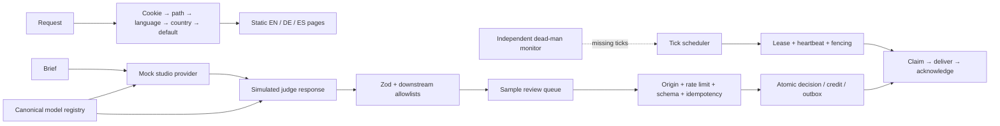

# ghost-creative-demo

A demo repository of patterns from [Ghost Creative](https://ghostcreative.ai), independently reimplemented with synthetic data; this is **not the production code**.


A five-minute tour: open the landing page, try the review queue, then read the six modules below. Everything runs locally. No accounts, environment variables, database setup, paid APIs or external services are needed.

## Run it

Use Node.js 24 LTS. From this directory:

```sh
npm install
npm test
npm run dev
```

Open [localhost:3000](http://localhost:3000). For production: `npm run build`, then `npm start`. Run `npm run typecheck` and `npm run lint` for the remaining checks. [BUILD-NOTES.md](BUILD-NOTES.md) records actual local results, with reproducible checks and limits.

## Architecture



The review samples pass through the mock pipeline once per server process. The scheduler and delivery protocol are executable library examples, exercised by tests; no background service or outbound sender starts automatically.

## Six modules

### 1. Locale negotiation

The saved preference wins over a link's language prefix. That keeps navigation consistent, but a German preference also overrides an English link someone sends you; explicit language links provide the override. The remaining order is path → weighted `Accept-Language` → recognized host country → English. [locale.ts](src/lib/locale.ts) defines this order, [proxy.ts](src/proxy.ts) applies it, and [locale tests](tests/locale.test.ts) cover conflicts.

### 2. Public landing page

Three prerendered pages use server components, typed translations, CSS artwork and a locally packaged DM Sans font. The landing page does not fetch a session. Request nonces would make rendering dynamic, so this demo hashes the generated scripts instead; the cost is a build step coupled to Next's manifest format. The implementation spans [the page](src/app/[locale]/page.tsx), [layout](src/app/[locale]/layout.tsx) and [styles](src/styles/globals.css).

### 3. Generation and quality control

The judge response is simulated: it always approves and does not evaluate the draft. Only completeness, schemas, allowed values and the requested format are checked by code. The [pipeline](src/server/pipeline.ts) and [provider interfaces](src/server/providers.ts) demonstrate how a separate provider could fit, while the [registry](src/server/registry.ts) rejects aliases that collide and generator/judge pairs sharing a provider. These mocks make [failure tests](tests/pipeline.test.ts) deterministic, but provide no evidence of model quality or prompt-injection resistance.

### 4. Review queue

Try approving a sample, then reset the demo. Each browser session gets its own store and separate read/decision budgets; reset preserves the budgets and advances the revision. [ReviewQueue](src/components/review-queue.tsx) previews decisions, retains the UUID key after an ambiguous response and cancels superseded GETs. Pending decisions block other decisions until reconciled, which costs responsiveness on a slow connection. The [HTTP boundary](src/server/http.ts), [session store](src/server/sessions.ts), [API tests](tests/api.test.ts) and [browser scenarios](tests/browser/demo.spec.ts) cover isolation, reset, deadlines and retries.

### 5. Credits and transactional outbox

A debit, receipt and outbox event commit in one transaction. Expiring delivery leases use increasing fencing tokens to reject stale acknowledgements. This supports at-least-once delivery, so recipients still have to deduplicate events after a lost acknowledgement. The [copy-on-write store](src/server/store.ts) is small enough to clone per transaction; that would become expensive with a large queue. The [PostgreSQL reference](sql/001_credits_outbox.sql) and [PGlite tests](tests/sql.test.ts) cover the same booking contract, including rollback after an injected outbox failure and delayed lease candidates.

### 6. Tick scheduler

[scheduler.ts](src/server/scheduler.ts) accepts ticks rather than starting a daemon. It claims due work, renews leases and fences completion; [fake-clock tests](tests/scheduler.test.ts) exercise timeouts and missed ticks. The dead-man monitor must be polled independently: putting it in the worker's own process would hide a complete process outage. Aborting a job also cannot undo an external effect it has already sent.

## Decisions

- **Privacy:** locale negotiation never reads, records or logs an IP address. Country headers are coarse hints supplied by the host, not location truth or authorization; multilingual countries still need a user override. Only an explicit choice creates the locale cookie. Negotiated responses are private and not cached by a shared CDN, even though their HTML is prerendered.
- **Static pages with CSP:** request nonces would require dynamic rendering. `next.config.ts` sets restrictive headers; the build adds hashes for the exact static bootstrap scripts and framework fallback styles, then verifies the result. Production has no `unsafe-inline` or `unsafe-eval`; development allows framework tooling. Same-origin bundles remain permitted. Use the complete `npm run build` pipeline.
- **Small client boundary:** only the review interaction and error recovery need client components. Plain links preserve full static navigation. The font is served locally with no Google request, animation library or image service.
- **Atomicity before delivery:** the in-memory store has no `await` inside transactions. PostgreSQL uses row locks and `SKIP LOCKED`; tests compare debit, retry, rollback and fence behavior. Tokens are increasing, not gapless. Delivery is at least once, so a real recipient must deduplicate event IDs.
- **Bounded API inputs:** strict zod schemas, a 4 KiB body limit and a two-second total body deadline bound incoming data. Review sessions have separate read (20 burst, 2/s) and decision/reset (10 burst, 1/s) buckets, with a process-wide review cap of 60 burst / 10/s. At most 16 decision bodies are read concurrently, with two per session. Same-origin checks apply to decisions and resets. The webhook has its own 10 burst / 1/s bucket and the same body deadline. [Webhook verification](src/server/webhook.ts) authenticates the body and timestamp with HMAC, compares equal-length signatures with `timingSafeEqual`, and retains replay IDs through the complete acceptance window.
- **No demo credentials:** server-only modules hold an ephemeral, randomly generated webhook key. No sender is configured and no key is returned to the browser. Tests inject their own ephemeral key.

## Limits

This is an unauthenticated sandbox with three synthetic samples and twelve fictional credits per browser session. A random HttpOnly, SameSite=Strict cookie selects the session (Secure on HTTPS). At most 100 sessions are kept in memory; creating another evicts the oldest by creation time. Tabs in one browser share a session. Reset clears only that session; restart or eviction also discards it. State and limits do not synchronize across processes. Creating new sessions can bypass per-session budgets and evict other visitors, so the global cap is still necessary; it is not a distributed abuse defense. No real payments, publishing, model evaluation or customer information are present; mock judgment is not evidence of creative quality, and the sample creatives are English in every locale.

The PostgreSQL reference covers credits, idempotency and outbox leases; it is not a full application migration. Each PGlite test uses a fresh in-memory database. A trigger delays an insert candidate and interleaves a successful claim for another resource before the conflict update; this catches reuse of stale candidate values but does not exercise actual multi-connection lock contention. No local PostgreSQL server was available for that check. A real deployment needs authentication, tenant isolation, durable idempotency/replay storage, distributed rate limits, trusted proxy configuration and an independently hosted monitor. A process cannot report its own complete outage. Jobs must honor abort signals and fence external effects themselves.

CSP finalization depends on the pinned Next.js manifest format and fails when that assumption changes. The styled global 404 uses Next's experimental `globalNotFound` option. The GitHub Actions workflow belongs **only to this demo** and runs install → typecheck → lint → test → build → Chromium browser checks. CI installs Chromium with `npx playwright install --with-deps chromium`; `npm run test:browser` starts the built app with `next start` through Playwright and is mandatory. The browser suite verifies delivered CSP, hydration, rejected inline JavaScript and API error recovery.

MIT licensed. No production source files, history, operational routes, real prompts or brand binaries were copied.
